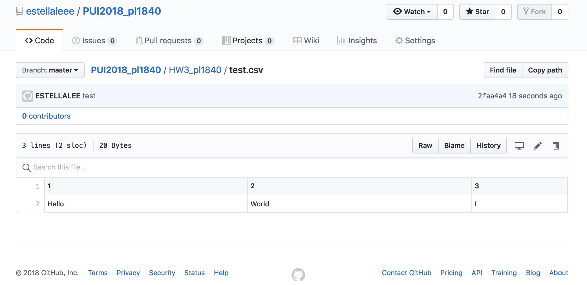
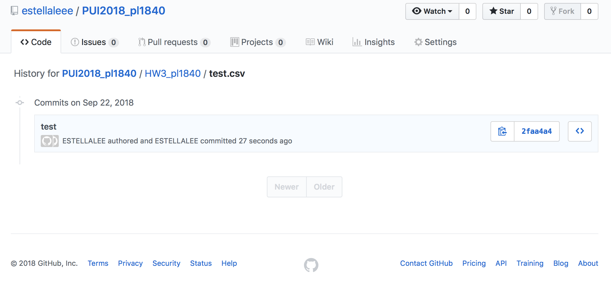
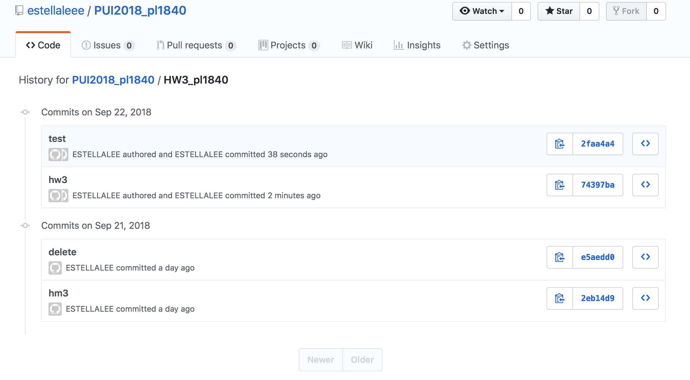
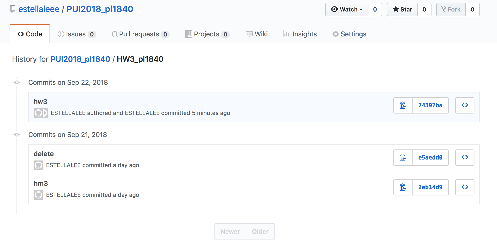

# PUI2018 Homework3.

## Assignment 1: follow the instructions
- Create a folder named HW3_pl1840 in PUI2018_pl1840 repository along with a README.md
- Create test.csv in HW3_pl1840
- Take a screenshot of csv file, file history and HW3_pl1840 code history
- Delete the csv file on terminal using the code provided
- Then take a screenshot of HW3_pl1840 code history
- I forgot to take a screenshot of my terminal to show that there is no test.csv in my HW3_pl1840 folder when I did this part of homework. HW1_A1.5 is the sceenshot I took after I completed the rest of the homework so the ls shows lots of work which is inconsistent with previous sceenshots, but there is no test.csv now.

## Assignment 2: Read CSV files with pandas and use NYC open data portal
- I chose 2015-2017 Historical Daily Attendance by School as my data, and read it with pandas in ADRF
- Displayed top eight rows and the last 3 rows of the data frame
- Create a new data frame which has only 2 numerical columns (e.g., ‘enrolled’, ‘absent’)
- Displayed top 5 rows of the new data frame
- Plot a scatter plot use one variable against the other
- And the scatterplot shows that these two numerical variables does not have a strong correlation between each other

## Extra Credit Assignment: work with and APIs and dates in Pandas
- Exact the same dataset data using the NYC Open Data API, and open the json file with pandas 
- With the time variable, displayed first 3 rows of the data frame 
- Dropped other columns and kept ‘enrolled’, ‘absent’, and ‘date’
- Display the reduced data frame
- Using the timestamp overwriting the original ‘date’ column before plotting
- Plot the scatter plot using ‘date’ and ‘enrolled’
- Plot the scatter plot using ‘date’ and ‘absent’

## Assignment 3: tracking each vehicle for a line
- Applied for the API key on MTA website
- Read the json file
- Find the number of buses in file
- Find the latitude and longitude information
- Use sys.argv to create inputs
- Replace API key and bus line to two input variables

## Assignment 4: next stop information
- Similar to assignment 3
- Find the stop information and bus status in json file
- For buses that do not have stop and status information, output “N/A” in the fields
- To achieve this output, using ‘try else’ inspired by “http://www.runoob.com/python/python-exceptions.html”
- Use sys.argv to create inputs
- Use fout function to create file input and output – csv file (inspired by https://pentangle.net/python/handbook/node35.html)
- Replace API key and bus line to two input variables

