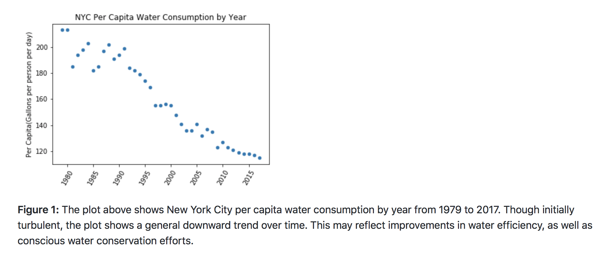

Dear Andrea,

I have reviewed your HW8 plot and here’s some viewpoints and suggestions.

- Clarity: In your title, I understood that your plot is about NYC per capita water consumption by year. In the caption you mentioned that the data is demonstrated water consumption by year from 1979 to 2017, but the label on your x-axis of your plot only shows 1980 to 2015. So this is a little bit unclear to me when reading your plot. 

- Esthetic: my suggestion is that you can use seaborn library to plot a grid background and fit a regression line to make the scatter point more clear corresponding to each year. The code might be like this: sns.lmplot(x=‘Year’, y=‘Per Capita(Gallons per person per day)’, data=water, fit_reg=True)

- Honesty: After read your notebook, I think this plot honestly reproducing the data you selected.

My suggestion are: set the x-axis label more clearly; use seaborn to create a grid background and fit a regression line to demonstrate the downward trend over time. But overall, I think you did a good job on this assignment: this plot is readable and meaningful.

Your classmate, Pengzi Li

--------------------------------------------------------------------------------

