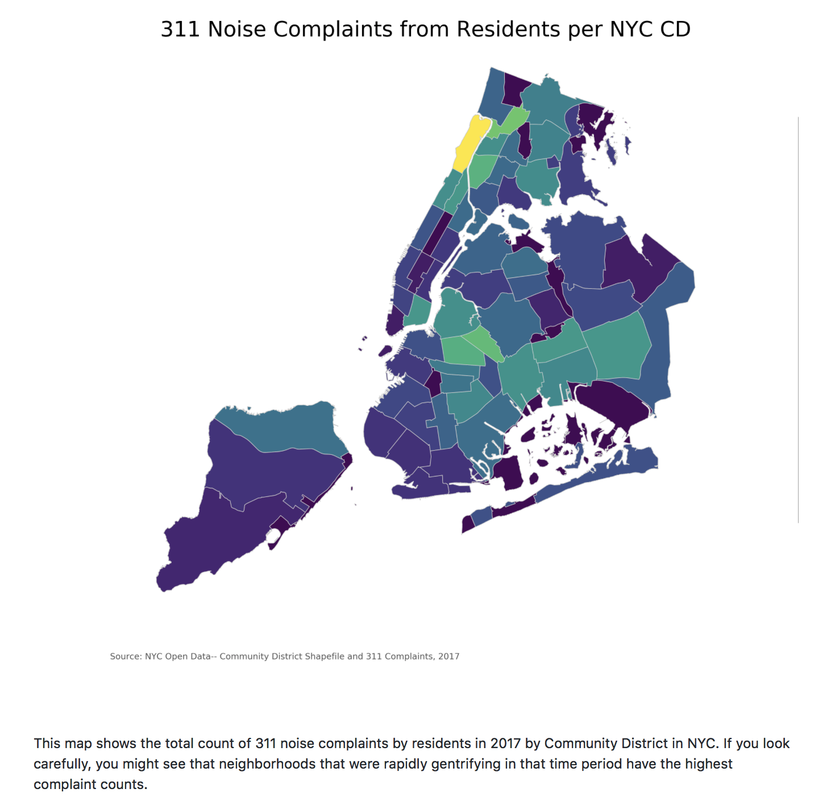

Dear Nicholas,

I have reviewed your HW8 plot and here’s some viewpoints and suggestions.

- Clarity: From your title, I understood that your plot is about 311 noise complaints from residents per NYC community district (I use this topic on my plot too!). I think you did a good job on adding annotation at the bottom of the plot, which made me wonder did you just copy a plot online and handed in as your homework? Just kidding! However, you mentioned in your caption that the neighborhoods were rapidly gentrifying in that time period have the highest complaint counts. I’m sorry that I have no idea how to observe this feature on your plot. If there is a gentrifying in a time period, should this plot be a gif?

- Esthetic: The plot looks quiet pretty at the first glance. But when I try to analysis the plot according to your caption, the color confused me. Normally, darker color means large number on visualization, while lighter color usually means small number. In your plot, I need to look very carefully on your color bar to figure out the meaning of the color. 

- Honesty: After read your notebook, I think this plot honestly reproducing the data you selected.

My suggestion are: specify what do you mean by the neighborhoods were rapidly gentrifying in that time period have the highest complaint counts; adjust the color bar to make the plot easily read and understandable. But overall, I think you already did a great job on this assignment. I was trying to do exactly the same plot as yours, but I don’t know how to find a shape file that contains zipcode, so I cannot merge the 311 data and shape file together, and I just gave up on this idea. I learned a lot from your notebook, thanks for the great job!

Your classmate, Pengzi Li

--------------------------------------------------------------------------------

