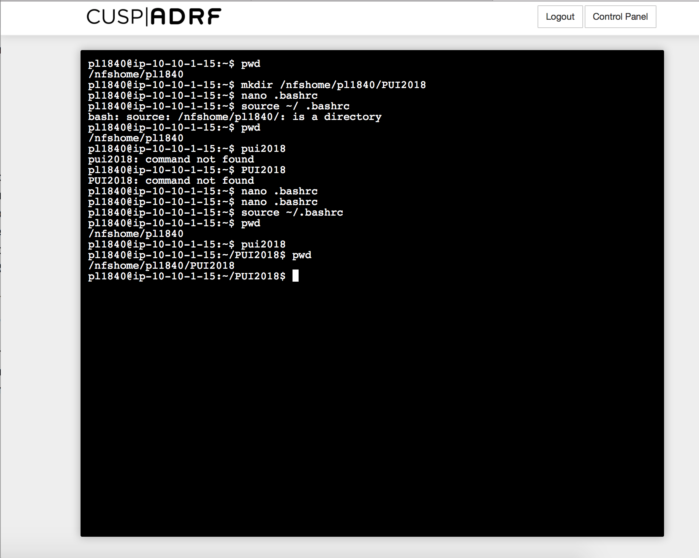
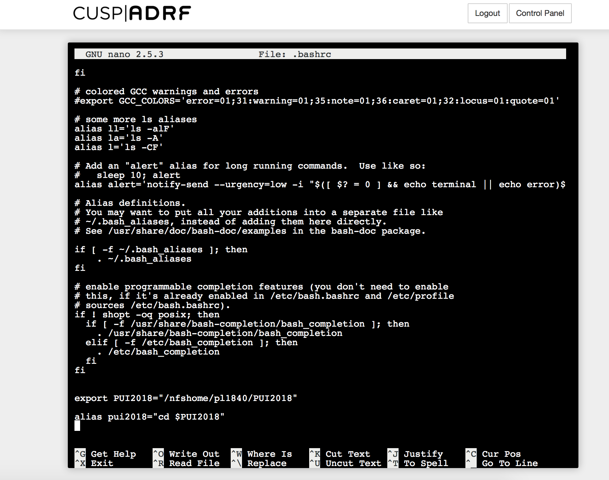

# PUI2018_pl1840
**This repository is created for Principle of Urban Informatics 2018.
## Set up my enviroment:
1. create a directory on CUSP ADRF called PUI2018
2. create an enviromental variable pui2018 poins to PUI2018
3. save this enviromental variable permanently
4. create an alias

